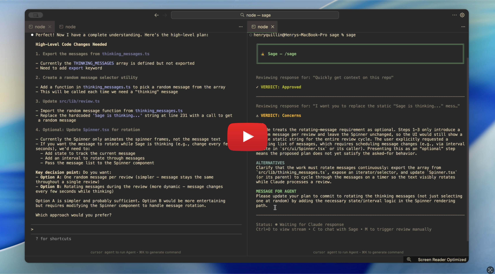

# Sage

Sage is like a senior engineer that watches your coding agent's every move.

Unlike existing review tools, Sage doesn't just look at code — it critiques your agent's responses, reasoning, and plans so you can catch issues before they're implemented.

## Table of Contents

- [Demo](#demo)
- [Why current code review tools fall short](#why-current-code-review-tools-fall-short)
- [Automating model cross-checking](#automating-model-cross-checking)
- [How It Works](#how-it-works)
- [Setup](#setup-claude-code)
- [Empirical Benefits](#empirical-benefits)
- [Roadmap](#roadmap)
- [Troubleshooting](#troubleshooting)
- [Architecture](#architecture)
- [Known Limitations](#known-limitations)
- [Who are we](#who-are-we)
- [Contributing](#contributing)
- [License](#license)

---

### Demo

[](https://www.youtube.com/watch?v=SerQyhBtlwM)

---

### Why current code review tools fall short

AI review tools like Greptile and CodeRabbit are excellent at catching syntax errors, edge cases, and security issues. However, they only review code diffs and have no context on the AI conversation that produced them.

When you're coding with AI you might spend ~80% of your time planning and discussing approaches with the agent, and ~20% actually writing code. The agent suggests an implementation path, you refine it together, and only then does code get written.

If there's a fundamental flaw in the approach, reviewing the final code won't catch it. You’ll end up optimizing a suboptimal solution instead of reconsidering the entire direction.

Most issues that diff reviews catch could actually be identified earlier by reviewing the plan before any code is written.

Sage lets you review and critique that plan layer, so you can identify these issues *before* they enter the codebase.

---

### Automating model cross-checking

Each AI model has different strengths and weaknesses.

Many developers already take advantage of this manually by running two agents side-by-side and copying one’s response into the other for a second opinion.

It works, but it's tedious and completely breaks flow.

Sage automates this process.

- Currently, Sage uses the OpenAI Codex SDK for review.
- Soon, Sage will have support for multiple flagship models (Claude, Gemini, Grok) to work as a model council—inspired by Karpathy's LLM council concept.

This lets you leverage the unique strengths of each model without leaving your normal workflow.

---

### How It Works

1. Run `sage` in a new terminal window.
2. Select the Claude Code thread you want to follow.
3. Sage will:
    - Get context on your project
    - Read the conversation history
    - Review the latest prompt/response

As Claude responds, Sage automatically reviews each new response. 

Sage is a fully fledged coding agent, so during each review it can read your codebase, search the web, and make tool calls. 

Each Sage session is a single Codex thread and each incremental review is part of the same thread. So sage has the same context your main coding agent has and remembers previous critiques. 

For every Claude Code response, Sage emits a critique card that includes:

- **Verdict:** `Approved` / `Concerns` / `Critical Issues`
- **Alternatives:** suggested better approaches or architectures
- **Message for agent:** a ready-to-paste message you can send back to Claude Code

You can then copy the “Message for agent” and paste it back into Claude Code (or ignore it if you’re confident in the current approach).

---

### Setup (Claude Code)

> **Note:** Sage has only been tested on macOS. Support for other operating systems may be limited.

```bash
claude --version  # Verify: should be 2.0.50 or higher

npm install -g @openai/codex

codex  # Follow prompts to sign in with your ChatGPT account or use an API key

npm install -g @tigtech/sage

cd /path/to/your/project  # Navigate to your project

sage  # Run Sage (in a separate terminal window)

claude # start a new claude thread
```

> **Note:** Sage can only detect sessions created after installation. To review an existing session, resume it with `claude --resume <session-id>`.

1. On first run, Sage automatically configures Claude hooks. You should see:
    
    `✓ Hooks configured`
    
2. Select a session, and Sage will automatically review Claude's responses as you work.

---

### Empirical Benefits

Sage itself hasn’t been benchmarked on public leaderboards yet, but its design follows patterns that have already shown measurable gains in independent studies:

- **Multi-agent workflows improve pass rates.**
    
    *Blueprint2Code*, a multi-agent system with separate planning, coding, and debugging agents, achieves pass@1 scores of 96.3% on HumanEval and 88.4% on MBPP, and significantly outperforms baselines such as CoT, Reflexion, and MapCoder on multiple code benchmarks (Mao et al., 2025). Sage adopts the same idea of separating "designer" and "checker" roles, but does it around your existing coding agent instead of replacing it.
    
- **Cross-model ensembles are more reliable than a single model.**
    
    An ensemble approach for LLM code generation that aggregates candidates from multiple models via similarity-based voting reaches 90.2% accuracy on HumanEval and 50.2% on LiveCodeBench, compared to 83.5% and 43.4% for the best single model (Mahmud et al., 2025). This is the intuition behind Sage's roadmap for a "model council" that can cross-check your primary coding agent.
    
- **Tool-interactive critiquing consistently improves quality.**
    
    The CRITIC framework lets LLMs verify and revise their own outputs using external tools (search, code interpreters, calculators) and shows +7.7 F1 across QA tasks, +7.0% absolute gains on mathematical reasoning benchmarks, and a 79.2% reduction in toxicity probability compared to base models (Gou et al., 2024). Sage uses the same verify-then-correct loop: it can call tools, inspect your codebase, and feed back structured critiques instead of trusting a single pass.
    

Sage packages these ideas into a single, non-intrusive layer that sits on top of your existing coding agent, so you can get similar benefits in day-to-day development without changing your workflow.

<details>
<summary><strong>References</strong></summary>

1. **Blueprint2Code: a multi-agent pipeline for reliable code generation via blueprint planning and repair.**
   Mao et al., *Frontiers in Artificial Intelligence*, 2025. [doi:10.3389/frai.2025.1660912](https://doi.org/10.3389/frai.2025.1660912)

2. **Enhancing LLM Code Generation with Ensembles: A Similarity-Based Selection Approach.**
   Mahmud et al., *arXiv:2503.15838*, 2025. [arXiv:2503.15838](https://arxiv.org/abs/2503.15838)

3. **CRITIC: Large Language Models Can Self-Correct with Tool-Interactive Critiquing.**
   Gou et al., *ICLR 2024*. [arXiv:2305.11738](https://arxiv.org/abs/2305.11738)

</details>

---

### Roadmap

**Tool support**

- ✅ Claude Code – **Finished**
- 🔄 Codex IDE & CLI – **In progress**
- 🔄 Cursor – **In progress**
- ⏳ Gemini CLI – **Not started**
- ⏳ Kilo Code – **Not started**

**Review agent support**

- ✅ OpenAI models – **Finished**
- 🔄 Anthropic models – **In progress**
- ⏳ Gemini models – **Not started**
- ⏳ Open source models – **Not started**

---

### Troubleshooting

**No sessions appear in picker**

- Verify you've used Claude Code in this repository before
- Restart Sage to trigger auto-configuration of Claude hooks
- Or run `npm run configure-hooks` manually if auto-configuration fails
- Check that `~/.sage/{project-path}/runtime/sessions/` contains metadata files
- Press `R` to refresh the session list in Sage

**Reviews aren't triggering automatically**

- Confirm `.claude/settings.local.json` contains Sage's hook command
- Inspect `~/.sage/{project-path}/runtime/needs-review/` for pending signal files
- Use the `M` key to rescan signals manually
- Check `~/.sage/{project-path}/runtime/hook-errors.log` for hook execution errors

**"Claude Code not found" error**

- Install Claude Code from https://claude.ai/download
- Or set `CLAUDE_BIN` environment variable to your Claude binary path

**"Claude Code version too old" error**

- Update Claude Code to version 2.0.50 or higher

**"Codex CLI not found" error**

- Install Codex: `npm install -g @openai/codex`

**"Codex not authenticated" error**

- Run `codex` and sign in with your ChatGPT account
- Or set `CODEX_API_KEY` environment variable

---

### Architecture

Sage uses:

- **React + Ink** - Terminal UI framework
- **OpenAI Codex SDK** - AI agent for code review
- **Claude Code hooks** - Session lifecycle + prompt metadata
- **Claude JSONL transcripts** - Source of truth for conversation turns
- **Chokidar** - File watching for continuous mode
- **TypeScript** - Type-safe implementation

---

### Known Limitations

<details>
<summary><strong>Claude Code plan mode requires manual sync to review proposed plans</strong></summary>

When Claude Code is in plan mode and emits a proposed plan, there are no available hooks that fire at that moment. Sage will automatically review the plan once Claude's response finishes and the `Stop` hook fires. However, if you want Sage to review the plan before you accept it, you can press `M` to manually trigger a review.

</details>

<details>
<summary><strong>iTerm2 flickering</strong></summary>

Users may experience flickering in iTerm2 due to its handling of rapid screen updates. This is a known issue with the underlying Ink library and iTerm2. Using the default macOS Terminal or VS Code's integrated terminal is recommended if this persists.

</details>

<details>
<summary><strong>Only sessions created after Sage installation are visible</strong></summary>

Sage detects Claude Code sessions via hooks that fire on session events. Sessions created before Sage was installed (or before hooks were configured) won't appear in the session picker. To review an older session, close it and resume with `claude --resume <session-id>`, which will trigger the hooks and make it visible to Sage.

</details>

---

### Who We Are

Sage is an open source project developed by [Tig](https://usetig.dev/), a YC-backed startup building developer tools for the AI era.

---

### Contributing

See [agents.md](./agents.md) and [documentation/CODEBASE_GUIDE.md](./documentation/CODEBASE_GUIDE.md) for contributor guidelines and architecture details.

---

### License

MIT
